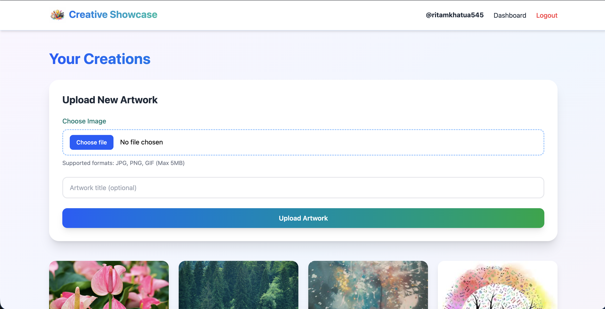

#  Creative Showcase

Creative Showcase is a modern full-stack web platform designed for artists and creators to store, manage, and publicly present their digital creations. It provides a smooth gallery experience with secure authentication, personalized dashboards, and cloud-based image storage.

---

## 🚀 Live Demo

[Creative Showcase Live](https://creative-showcase-amarnath-kumar.vercel.app/)

Demo Credentials:

```
Email: ritamkhatua545@gmail.com
Password: creative
```

---


### ✨ Highlights
	•	Secure user authentication with JWT
	•	Personal dashboard to manage uploads
	•	Publicly shareable creator profiles
	•	Cloud-based image storage
	•	Responsive and visually clean UI

### 🔐 Authentication System

	•	User signup & login
	•	JWT-based authentication stored in HTTP-only cookies
	•	Route protection for private pages
	•	Secure logout functionality

### 🖼️ Image Management

	•	Upload images directly from the dashboard
	•	Images stored using Cloudinary
	•	Image metadata managed in MongoDB
	•	Delete and manage uploaded content easily

### 🧑‍🎨 User Profiles

	•	Private dashboard for creators
	•	Public profile route: /profile/:username
    •	Each profile displays a personal image gallery
	•	Profiles can be shared with others

### 🏠 Landing Page Experience

	•	Displays images from all creators
	•	Pinterest-style masonry layout
	•	Fully responsive across devices
	•	Skeleton loaders for smoother UX

### 🚀 Performance & Security

	•	API rate limiting to prevent abuse
	•	Lazy loading of images
	•	Secure cookie handling
	•	Optimized API responses

---

## 📸 Screenshots





---

## 🛠️ Tech Stack

### Frontend

- React (Vite)
- Tailwind CSS (v4)
- Zustand (state management)
- Zod (form validation)
- Axios
- React Router
- React Hot Toast

### Backend

- Node.js
- Express.js
- MongoDB + Mongoose
- Cloudinary (image storage)
- JWT (authentication)
- Express Rate Limit
- Cookie Parser

---

## 📂 Project Structure

```
Creative-Showcase/
│
├── backend/
│   ├── config/
│   │   ├── db.js
│   │   └── cloudinary.js
│   ├── controllers/
│   ├── middlewares/
│   ├── models/
│   ├── routes/
│   ├── .env
│   └── index.js
│
├── frontend/
│   ├── src/
│   │   ├── api/
│   │   ├── components/
│   │   ├── pages/
│   │   ├── routes/
│   │   ├── store/
│   │   ├── schemas/
│   │   ├── App.jsx
│   │   ├── index.css
│   │   └── main.jsx
│   ├── public/
│   └── vite.config.js
│
└── README.md
```

---

## ⚙️ Environment Variables

Create a `.env` file inside the **backend** folder:

```env
PORT=5000

MONGO_URI=mongodb://127.0.0.1:27017/creative_showcase

JWT_SECRET=your_jwt_secret

CLOUDINARY_CLOUD_NAME=your_cloud_name
CLOUDINARY_API_KEY=your_api_key
CLOUDINARY_API_SECRET=your_api_secret
```

---

## ▶️ How to Run Locally

### 1️⃣ Clone the Repository

```bash
git clone https://github.com/Amarsah15/creative-showcase.git
cd creative-showcase
```

### 2️⃣ Backend Setup

```bash
cd backend
npm install
npm run dev
```

Backend runs at:

```
http://localhost:5000
```

### 3️⃣ Frontend Setup

```bash
cd frontend
npm install
npm run dev
```

Frontend runs at:

```
http://localhost:5173
```

---

## 🔄 API Overview

### Auth Routes

```
POST   /api/v1/auth/signup
POST   /api/v1/auth/login
POST   /api/v1/auth/logout
GET    /api/v1/auth/me
```

### Image Routes

```
POST   /api/v1/images/upload
GET    /api/v1/images/myimages
GET    /api/v1/images/user/:username
GET    /api/v1/images/random
DELETE /api/v1/images/:id
```

---

## 🧠 Architecture Choices

	•	Cloudinary chosen for scalable image storage
	•	JWT stored in cookies for better security
	•	Zustand used instead of Context API for cleaner state logic
	•	MongoDB aggregation for random image display
	•	Rate limiting to enhance API protection

---

## 🔮 Future Scope

	•	Like & comment system
	•	User following feature
	•	Image tags & categories
	•	Search functionality
	•	Dark mode support
	•	Infinite scrolling
	•	OTP-based authentication

---

## 👨‍💻 Author

**Ritam Khatua**

---
